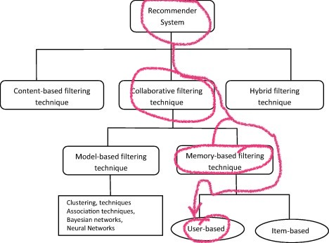

This is a short step-by-step tutorial on collaborative filtering based recommendation systems on <a href="http://jmcauley.ucsd.edu/data/amazon/">Amazon product data </a>. Detailed instructions are included in the Jupyter Notebook, so feel free to check it out. Below, I included materials I found super useful to learn about recommendation systems & Apache Spark (which is used to paralelize alternative least squares at the end of the notebook).

For instructional purposes, the code is not optimized for speed. 

source of the image: _"Recommendation systems: Principles, methods and evaluation"_ by Isinkayea, Folajimib and Ojokohc, http://doi.org/10.1016/j.eij.2015.06.005

# Resources:

## Data:
<a href="http://jmcauley.ucsd.edu/data/amazon/">Amazon's data set</a> contains reviews and metadata spanning from 1996 to 2014 and is an excellent source if you want to practice recommendation algorithms. As you might suspect, it's huge, but Julian McAuley from UCSD also shared smaller subsets. I decided to use one of the 5-core datasets which contain entries from users who reviewed at least 5 products and products which were reviewed at least 5 times, which drastically limits the size of it allowing to run costly algorithms (such as ALS) on a personal laptop within a reasonable time (few minutes).

## Readings:

Blog posts about collaborative filtering and Alternative Least Squares: 

Andrew Ng's awesome <a href="https://www.coursera.org/learn/machine-learning/home/week/9">intro to recommender systems</a> (part of his ML coursera series)

Ethan Rosenthal's excellent blog post about <a href="http://blog.ethanrosenthal.com/2015/11/02/intro-to-collaborative-filtering/">collaborative filtering</a> and <a href="http://blog.ethanrosenthal.com/2016/01/09/explicit-matrix-factorization-sgd-als/">matrix factorization</a>.

bugra on <a href="http://bugra.github.io/work/notes/2014-04-19/alternating-least-squares-method-for-collaborative-filtering/">Alternating Least Squares</a>.

Alex Abate on <a href="http://alexabate.github.io/2016/11/05/movie-lens.html">collaborative filtering</a> - I heavily borrowed from her prediction rating code.

## Apache Spark

Using Apache Spark makes a lot of sense when we're using iterative algorithms (such as gradient descent or alternative least squares) as it leverages its capacity for caching / persisting (taking a snapshot of the data and iterating only over steps which are unique across iterations).

### Running Apache Spark with Jupyter Notebook:

It's not hard at all, actually! Make sure SSH is enabled on your machine, your Java is up to date, and <a href="http://spark.apache.org/downloads.html">download</a> + install Spark. In my case, in order to run it I need to execute in the Terminal:
<pre>

    $ export PATH=$PATH:/usr/local/spark/bin:/usr/local/spark/sbin

</pre>
followed by:
<pre>
    $ start-all.sh
</pre>
and to lanch Jupyter Notebook with Spark:
<pre>
    $ PYSPARK_DRIVER_PYTHON=ipython PYSPARK_DRIVER_PYTHON_OPTS="notebook --no-browser --ip="*"" pyspark --master local[*]
</pre>

Then, Jupyter Notebook will run on localhost:8888, your Spark cluster UI on localhost:8080 and Spark Jobs on localhost:4040 (type these in your browser). 
I got those tips from Austin Ouyang who wrote a great step-by-step <a href="http://blog.insightdatalabs.com/jupyter-on-apache-spark-step-by-step/">intro</a> and gave a great workshop at Insight Labs that I attended.

### Machine learning and collaborative filtering with Spark: 

http://spark.apache.org/docs/latest/mllib-guide.html

https://spark.apache.org/docs/latest/mllib-collaborative-filtering.html

A great tutorial on recommendations systems and Spark with MovieLens data: https://databricks-training.s3.amazonaws.com/movie-recommendation-with-mllib.html

# Requirements:

1. <a href="https://www.python.org/"> Python</a> (2.7)
2. <a href="http://jupyter.org/">Jupyter Notebook</a>
3. <a href="http://www.numpy.org/">NumPy</a>
4. <a href="http://www.scipy.org/">SciPy</a>
5. <a href="http://matplotlib.org/">matplotlib</a>
6. <a href="http://pandas.pydata.org">Pandas</a>
7. <a href="http://scikit-learn.org/stable/">scikit learn</a>

